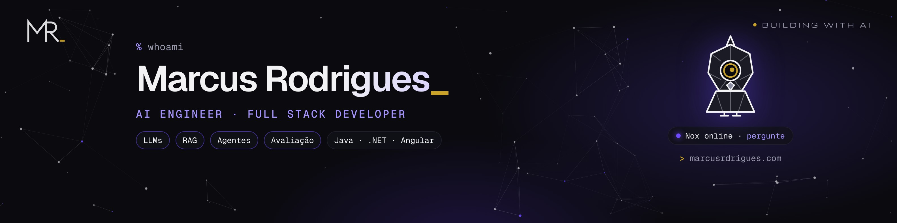
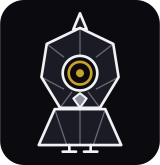

<p align="center">
  <a href="https://marcusrdrigues.com" target="_blank">
    
  </a>
</p>

<p align="center">
  <a href="https://marcusrdrigues.com" target="_blank"></a>
  <a href="https://linkedin.com/in/marcusrdrigues" target="_blank"></a>
  <a href="mailto:contato@marcusrdrigues.com"></a>
  <a href="https://www.npmjs.com/package/noxeval" target="_blank"></a>
</p>

---

## 👨🏻‍💻 Sobre mim

Sou desenvolvedor Full Stack com foco em **Engenharia de IA**: construo aplicações com LLMs, RAG e agentes conectadas a sistemas reais em Java e .NET, e trato IA como software de verdade, com testes, avaliação e segurança.

Vim do **Direito** para a tecnologia, e isso mudou meu jeito de programar: antes da primeira linha de código, quero entender a fundo o problema de quem vai usar.

- 🤖 Desenvolvi a camada de IA de uma plataforma de vistorias de campo para o setor público (+10 mil registros): classificação, resumos, detecção de inconsistências e chat sobre os dados
- 💬 Hoje construo um canal de suporte inteligente com RAG e busca semântica
- 🧪 Criei o **[noxeval](https://github.com/marcusrdrigues/noxeval)**, pacote open source para avaliar apps de LLM e agentes
- ⚖️ Em paralelo, desenvolvo um produto próprio de IA para o mercado jurídico
- 🔐 Estudando **Segurança em IA** (OWASP Top 10 para LLMs) e **agentes com Spring AI**
- 🏆 1º lugar no Hackathon Coti Informática × Criare Sistemas (2025)

---

## 🚀 Em destaque

<table>
  <tr>
    <td width="50%" valign="top">
      <h3><a href="https://marcusrdrigues.com/pt/nox">Nox</a></h3>
      O assistente do meu portfólio: RAG com busca híbrida e um agente com ferramentas só de leitura. Guarda de entrada, histórico assinado, limite de gasto e uma <b>avaliação pública</b> a cada mudança, mapeada no OWASP Top 10 para LLMs.
      <br /><br />
      <a href="https://marcusrdrigues.com/pt/nox"></a>
      <a href="https://marcusrdrigues.com/pt/nox#owasp"></a>
    </td>
    <td width="50%" valign="top">
      <h3><a href="https://github.com/marcusrdrigues/noxeval">noxeval</a></h3>
      Avaliação de apps de LLM, extraída do Nox: verificações determinísticas, juiz calibrado, erros plantados, correção humana às cegas com kappa de Cohen e, desde a 0.3, a <b>trajetória de agentes</b> (ferramenta certa, argumento certo, nada que não devia).
      <br /><br />
      <a href="https://www.npmjs.com/package/noxeval"></a>
      
    </td>
  </tr>
  <tr>
    <td width="50%" valign="top">
      <h3><a href="https://marcusrdrigues.com/pt/projetos/cedae-ia">IA para vistorias de campo</a></h3>
      Camada de IA sobre mais de 10 mil vistorias de um recadastramento no setor público: classificação, resumos, alertas de inconsistência e chat sobre um banco só de leitura. Concluído com atestado de capacidade técnica.
    </td>
    <td width="50%" valign="top">
      <h3><a href="https://marcusrdrigues.com/pt/projetos/hackathon-coti-criare">Hackathon Coti × Criare</a></h3>
      1º lugar em 24 horas com uma plataforma de cotações e negociação entre empresas e fornecedores, que depois virou produto: negociação ao vivo por WebSocket e demo pública.
    </td>
  </tr>
</table>

### 🔌 Converse com meu portfólio pelo seu assistente de IA

O site tem um servidor [MCP](https://modelcontextprotocol.io) só de leitura. Adicione como conector no Claude, no Cursor ou em qualquer cliente MCP e pergunte sobre o meu trabalho:

```
https://marcusrdrigues.com/api/mcp
```

---

## 🧠 Stack

### IA & LLMs
<p>
  
  
  
  
  
  
  
</p>

### Back-End
<p>
  
</p>

### Front-End
<p>
  
</p>

### Dados, Infra & Ferramentas
<p>
  
</p>

---

## 🐍 Contribuições

<p align="center">
  <picture>
    <source media="(prefers-color-scheme: dark)" srcset="https://raw.githubusercontent.com/marcusrdrigues/marcusrdrigues/output/github-contribution-grid-snake-dark.svg" />
    
  </picture>
</p>

---

<p align="center">
  <a href="https://marcusrdrigues.com" target="_blank">
    
  </a>
  <br />
  <sub>Este é o <b>Nox</b>, o mascote do meu portfólio. Pergunte qualquer coisa sobre mim em <a href="https://marcusrdrigues.com">marcusrdrigues.com</a>.</sub>
</p>

<p align="center">
  <i>"IA só gera valor quando é tratada como software de verdade."</i>
</p>
